
<h1 align="center">疫情居家办公系统</h1>

## 简介
疫情居家办公系统：角色分为管理员、用户；个人信息管理、办公预约、请假管理、外出申请、考勤管理、公告管理、用户管理、设备管理、健康状态记录、公司资料管理、登录注册和疫情信息更新。    --计算机毕业设计源码；毕设源码；java毕业设计源码

## 联系方式

<h3 align="center">获取完整代码与数据库文件 + 微信：deepguan QQ: 86050149 QQ群: 783742310</h3>

<h3 align="center">可帮忙远程部署 包运行成功！提供远程部署、修改代码、设计文档指导、代码讲解等服务！</h3>

## 功能介绍（完整见运行截图）
用户：基本功能包含登录、注册和退出。用户可访问个人中心，进行信息查看与修改，上传头像，以及处理办公事务。系统提供多种功能模块，如办公预约、请假申请、签到管理、薪资信息管理、外出申请和办公用品管理等。用户可以预约办公时间和用品，提交请假申请，并通过审核管理功能查看和管理申请的状态。

管理员：除了拥有用户的基本功能外，管理员在系统中具备更高级的权限，如用户管理、设备管理、公告信息管理等。管理员可以新增、删除、修改用户信息，审核外出申请和办公用品使用，管理公司资料。系统设计支持管理员对用户健康状态进行记录和跟踪，确保员工在居家办公期间的健康安全。

职员：职员可以通过系统进行日常办公操作，如查看公告、参与在线会议、管理任务等，确保工作效率。系统提供日程安排和任务管理功能，提高职员在居家办公的协作能力。职员还可以在系统中管理个人考勤、请假和外出安排信息。

高级用户：高级用户可以访问公司资料管理和健康动态跟踪功能，进行详细数据查询与分析。系统允许高级用户对公司重要资料和员工健康状况数据进行下载、修改和删除操作，并为其提供便捷的搜索与筛选功能。高级用户还可以协同管理员完成复杂办公事务管理任务。

## 运行截图
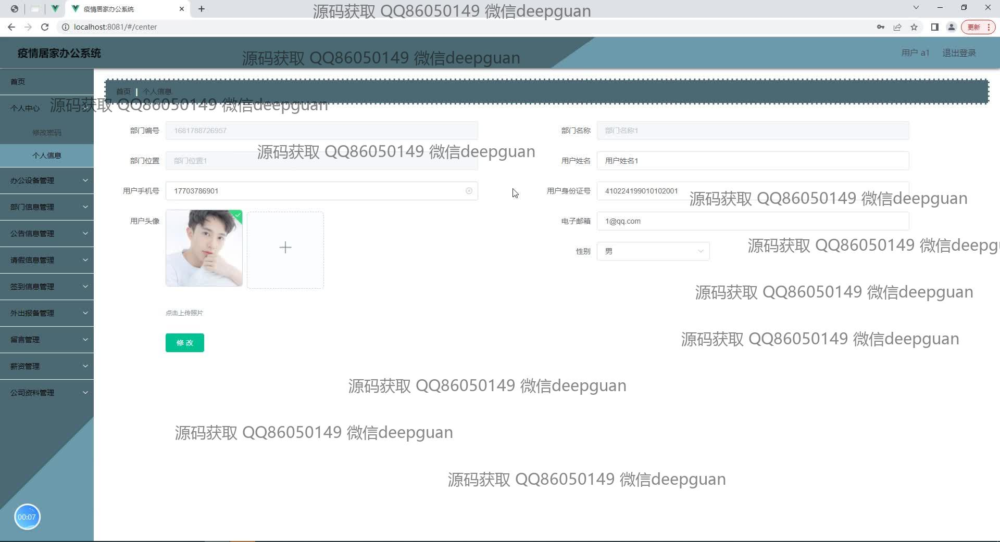
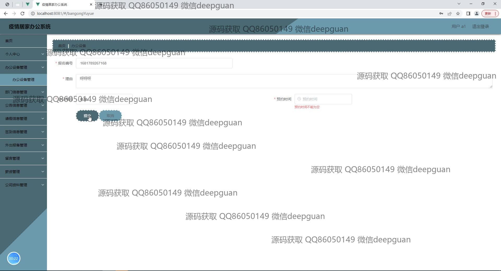
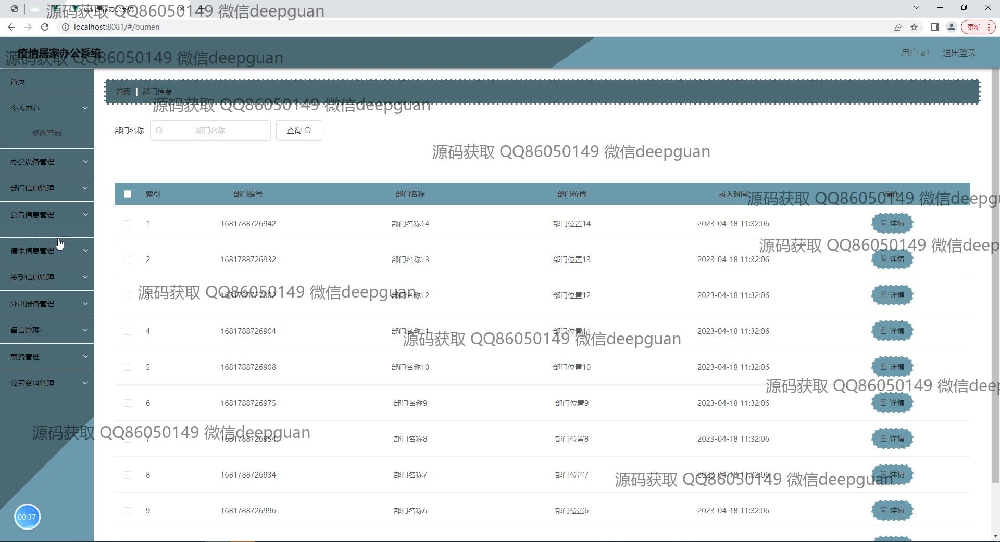
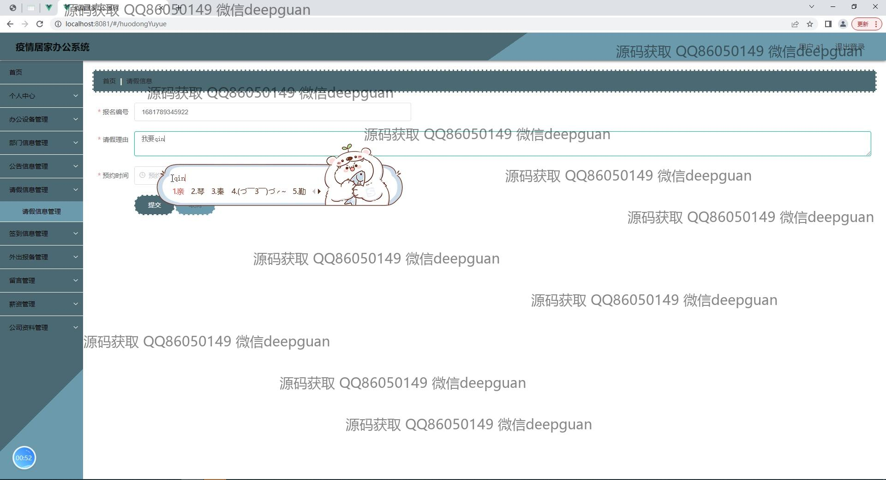
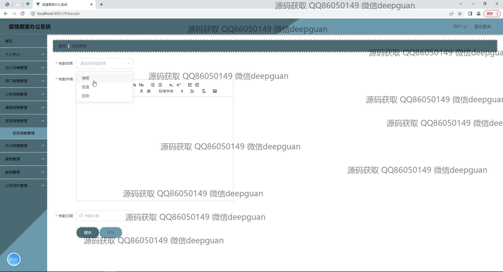
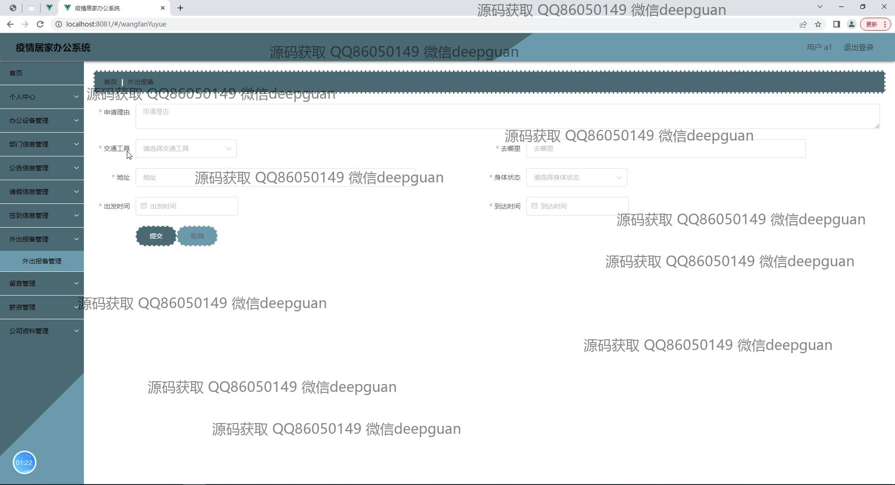
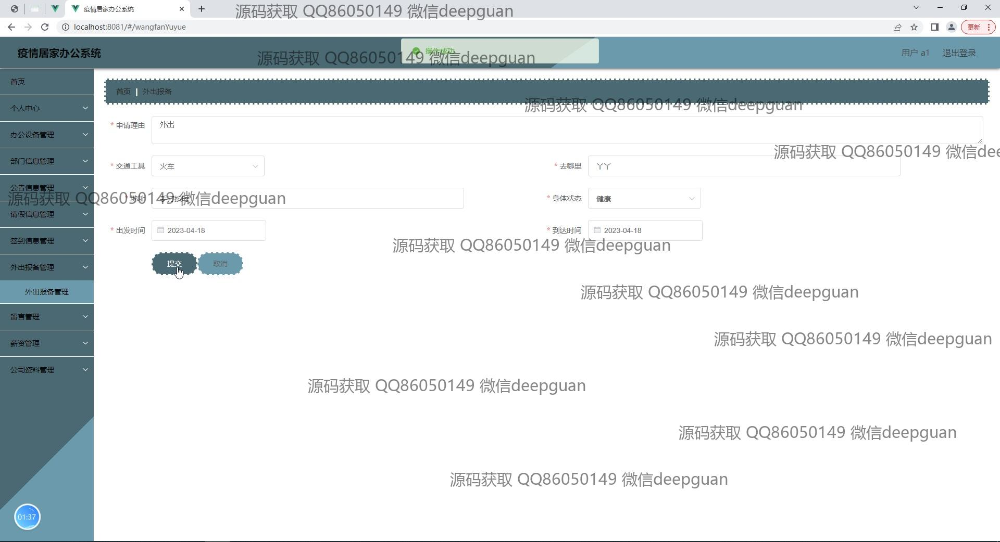
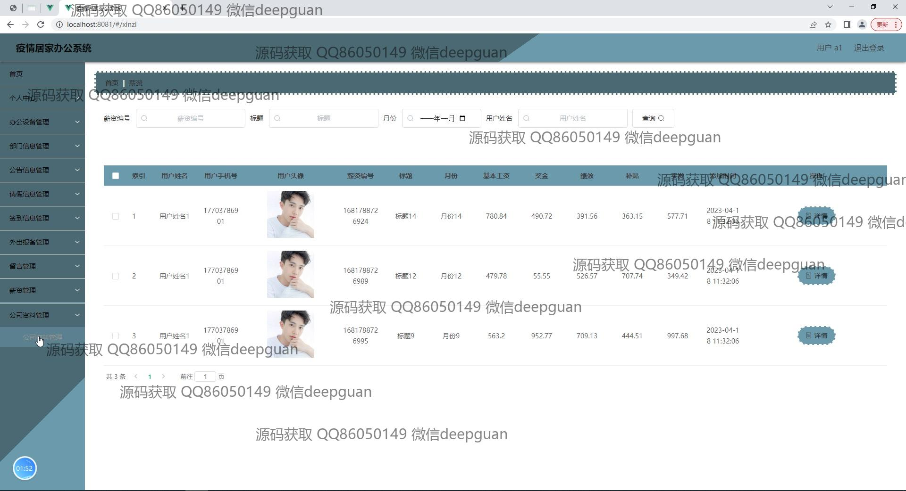
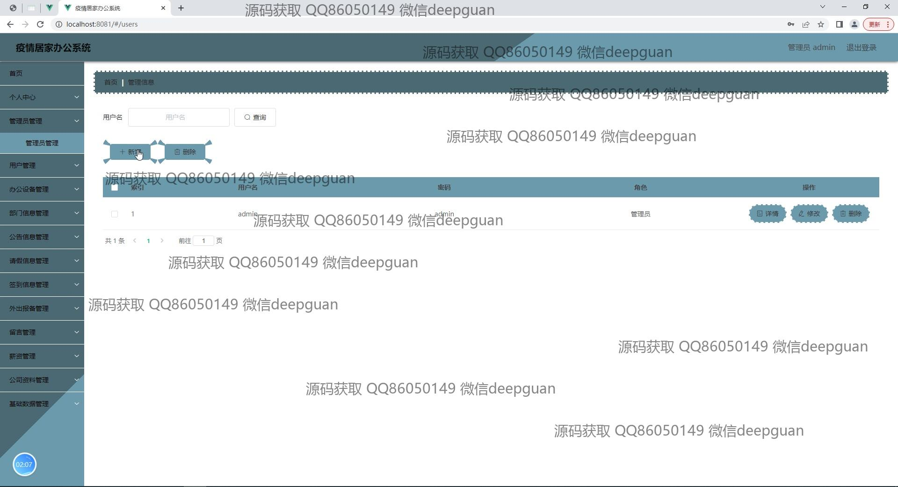
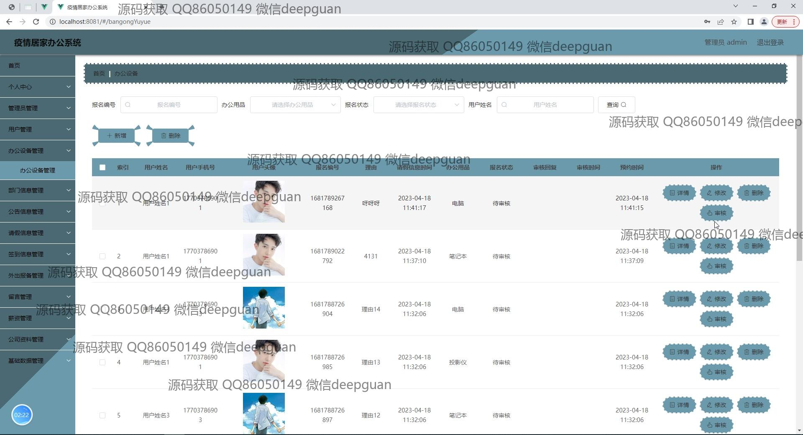
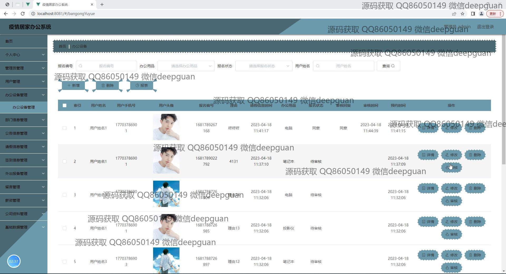
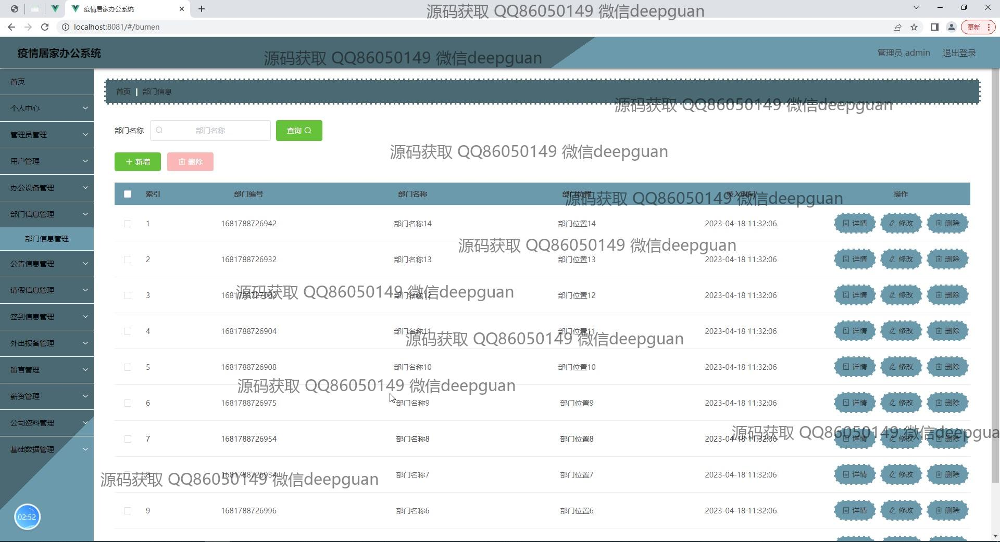
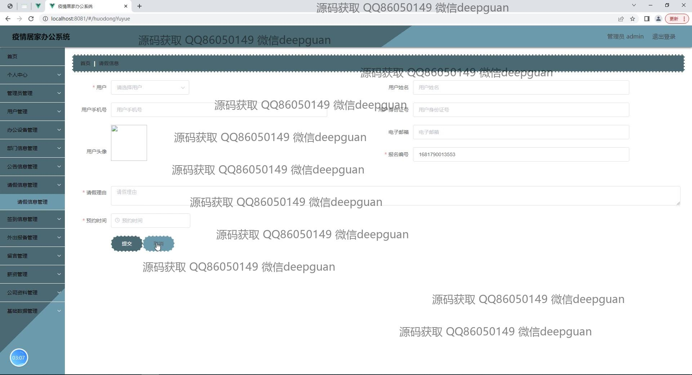
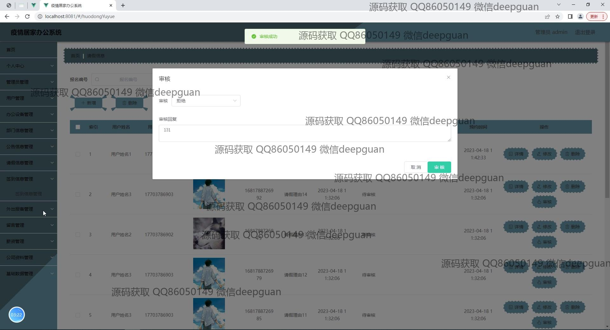
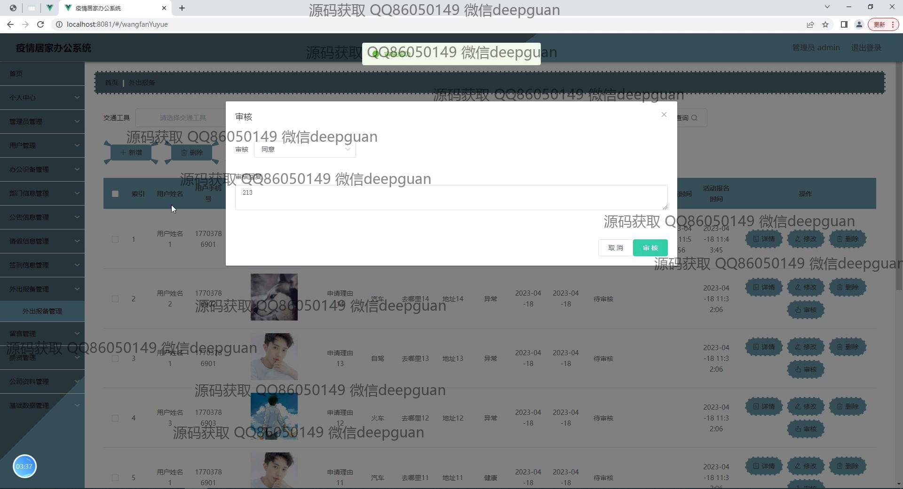
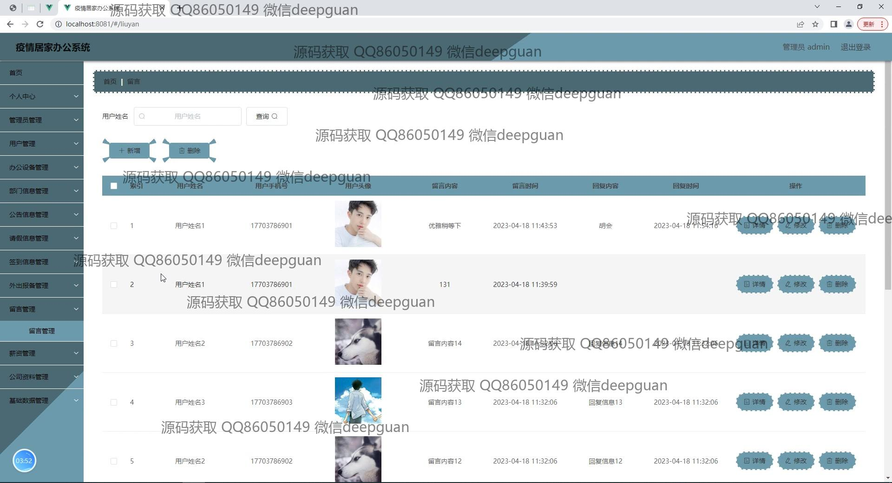
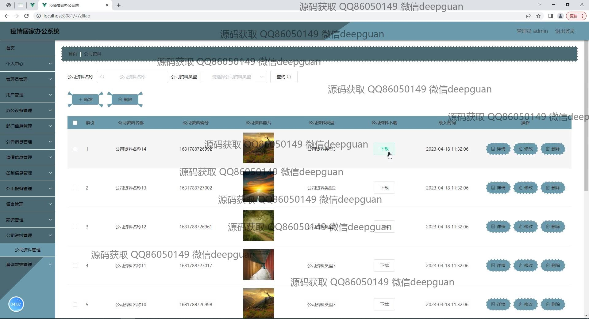
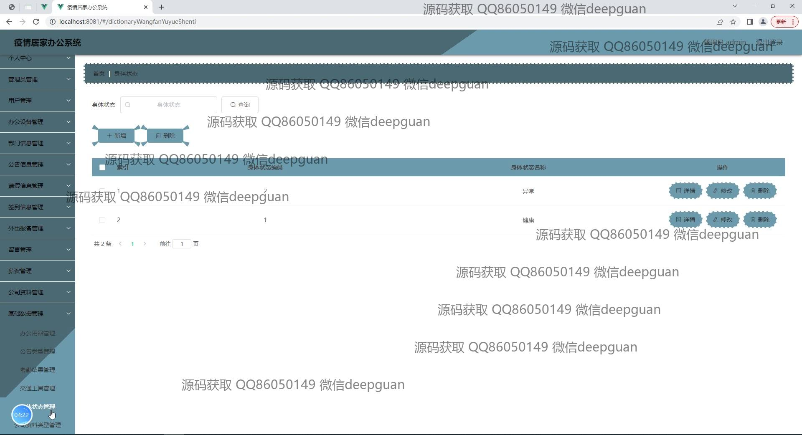

本代码来源于网络,仅供学习参考使用!

